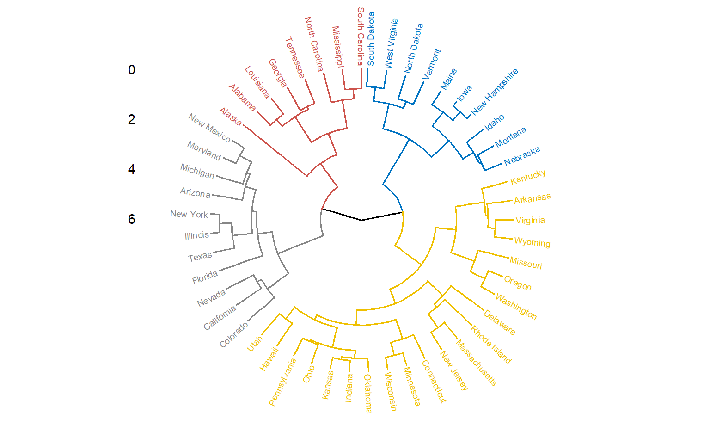

``` r
# Instalar paquetes con funciones útiles para aplicar los métodos
library(factoextra)
```

```
## Warning: package 'factoextra' was built under R version 4.4.2
```

```
## Loading required package: ggplot2
```

```
## Warning: package 'ggplot2' was built under R version 4.4.2
```

```
## Welcome! Want to learn more? See two factoextra-related books at https://goo.gl/ve3WBa
```

``` r
library(cluster)
```

```
## Warning: package 'cluster' was built under R version 4.4.2
```

``` r
library(dendextend)
```

```
## Warning: package 'dendextend' was built under R version 4.4.2
```

```
## 
## ---------------------
## Welcome to dendextend version 1.19.0
## Type citation('dendextend') for how to cite the package.
## 
## Type browseVignettes(package = 'dendextend') for the package vignette.
## The github page is: https://github.com/talgalili/dendextend/
## 
## Suggestions and bug-reports can be submitted at: https://github.com/talgalili/dendextend/issues
## You may ask questions at stackoverflow, use the r and dendextend tags: 
## 	 https://stackoverflow.com/questions/tagged/dendextend
## 
## 	To suppress this message use:  suppressPackageStartupMessages(library(dendextend))
## ---------------------
```

```
## 
## Attaching package: 'dendextend'
```

```
## The following object is masked from 'package:stats':
## 
##     cutree
```

``` r
library(dbscan)
```

```
## Warning: package 'dbscan' was built under R version 4.4.2
```

```
## 
## Attaching package: 'dbscan'
```

```
## The following object is masked from 'package:stats':
## 
##     as.dendrogram
```

``` r
library(ggplot2)
library(gridExtra)
```

# K-medoid


``` r
# Referencia: https://www.statology.org/k-medoids-in-r/

# cargar data
df <- USArrests

# quitar filas con valores nulos
df <- na.omit(df)

# escalar cada variable para tener una media de 0 y una desviación estándar de 1
df <- scale(df)

# ver las primeras seis filas de la base de datos
head(df)
```

```
##                Murder   Assault   UrbanPop         Rape
## Alabama    1.24256408 0.7828393 -0.5209066 -0.003416473
## Alaska     0.50786248 1.1068225 -1.2117642  2.484202941
## Arizona    0.07163341 1.4788032  0.9989801  1.042878388
## Arkansas   0.23234938 0.2308680 -1.0735927 -0.184916602
## California 0.27826823 1.2628144  1.7589234  2.067820292
## Colorado   0.02571456 0.3988593  0.8608085  1.864967207
```


``` r
# Dos gráficos que ayudan a decidir cuál es la cantidad óptima de clústers

# método del codo
fviz_nbclust(df, pam, method = "wss")
```


``` r
# Calcular la estadística de brecha en función del número de clústeres
gap_stat <- clusGap(df,
                    FUN = pam,
                    K.max = 10, # máximo de clústeres a considerar
                    B = 50) # iteraciones totales con bootstrap

# representación gráfica del número de conglomerados frente a la estadística de brecha
fviz_gap_stat(gap_stat)
```


``` r
# Semilla para poder reproducir el ejemplo
set.seed(1)

# Función que ejecuta el método k-medoids
kmed <- pam(df, k = 4)

# ver resultados
kmed
```

```
## Medoids:
##               ID     Murder    Assault   UrbanPop         Rape
## Alabama        1  1.2425641  0.7828393 -0.5209066 -0.003416473
## Michigan      22  0.9900104  1.0108275  0.5844655  1.480613993
## Oklahoma      36 -0.2727580 -0.2371077  0.1699510 -0.131534211
## New Hampshire 29 -1.3059321 -1.3650491 -0.6590781 -1.252564419
## Clustering vector:
##        Alabama         Alaska        Arizona       Arkansas     California 
##              1              2              2              1              2 
##       Colorado    Connecticut       Delaware        Florida        Georgia 
##              2              3              3              2              1 
##         Hawaii          Idaho       Illinois        Indiana           Iowa 
##              3              4              2              3              4 
##         Kansas       Kentucky      Louisiana          Maine       Maryland 
##              3              3              1              4              2 
##  Massachusetts       Michigan      Minnesota    Mississippi       Missouri 
##              3              2              4              1              3 
##        Montana       Nebraska         Nevada  New Hampshire     New Jersey 
##              3              3              2              4              3 
##     New Mexico       New York North Carolina   North Dakota           Ohio 
##              2              2              1              4              3 
##       Oklahoma         Oregon   Pennsylvania   Rhode Island South Carolina 
##              3              3              3              3              1 
##   South Dakota      Tennessee          Texas           Utah        Vermont 
##              4              1              2              3              4 
##       Virginia     Washington  West Virginia      Wisconsin        Wyoming 
##              3              3              4              4              3 
## Objective function:
##    build     swap 
## 1.035116 1.027102 
## 
## Available components:
##  [1] "medoids"    "id.med"     "clustering" "objective"  "isolation" 
##  [6] "clusinfo"   "silinfo"    "diss"       "call"       "data"
```


``` r
# Realizar PCA en los datos escalados
pca <- prcomp(df, center = TRUE, scale. = TRUE)
pca_data <- as.data.frame(pca$x[, 1:2])  # Extract the first 2 principal components
colnames(pca_data) <- c("PC1", "PC2")

# Graficar datos originales sin clustering
ggplot(pca_data, aes(x = PC1, y = PC2)) +
  geom_point(color = "orange", size = 3, alpha = 0.7) +
  labs(title = "Datos antes del clustering", x = "x", y = "y") +
  theme_minimal()
```


``` r
# Graficar los resultados del modelo final de k-medoides

library(factoextra)
fviz_cluster(kmed, data = df, 
             main = "Datos después del clustering")
```


``` r
# Datos antes del clustering
p1 <- ggplot(pca_data, aes(x = PC1, y = PC2)) +
  geom_point(color = "orange", size = 3, alpha = 0.7) +
  labs(title = "Datos antes del clustering", x = "x", y = "y") +
  theme_minimal()

# Datos después del clustering
p2 <- fviz_cluster(kmed, data = df) + labs(title = "Datos después del clustering")

# Compracación lado a lado
grid.arrange(p1, p2, ncol = 2)
```


``` r
# Agregar asignación de clúster a los datos originales
final_data <- cbind(USArrests, cluster = kmed$cluster)

# ver datos finales
head(final_data)
```

```
##            Murder Assault UrbanPop Rape cluster
## Alabama      13.2     236       58 21.2       1
## Alaska       10.0     263       48 44.5       2
## Arizona       8.1     294       80 31.0       2
## Arkansas      8.8     190       50 19.5       1
## California    9.0     276       91 40.6       2
## Colorado      7.9     204       78 38.7       2
```

# DBSCAN


``` r
#Referencia: https://github.com/sandipanpaul21/Clustering-in-Python/blob/master/11_DBScan_Clustering.ipynb


PuntosEnCirculo <- function(r, n = 100) {
  points <- data.frame()
  for (x in 1:n) {
    angulo <- 2 * pi / n * x
    points <- rbind(points, data.frame(
      x = cos(angulo ) * r + rnorm(1, 0, 30),
      y = sin(angulo ) * r + rnorm(1, 0, 30)
    ))
  }
  return(points)
}

#Crear circulos 
set.seed(42)

df1 <- PuntosEnCirculo(500, 1000)   
df2 <-PuntosEnCirculo(300, 700)    
df3 <- PuntosEnCirculo(100, 300)    
df <- rbind(df1, df2, df3)

#agregar ruido
set.seed(42)
ruido <- data.frame(
  x = sample(-600:600, 300, replace = TRUE),
  y = sample(-600:600, 300, replace = TRUE)
)

df <- rbind(df, ruido)

# DBCAN caso 1:
dbscan_caso1 <- dbscan(df, eps = 0.5, minPts = 5)

#
df$dbscan_labels <- dbscan_caso1$cluster


ggplot(df, aes(x = x, y = y, color = factor(dbscan_labels))) +
  geom_point(size = 2) +
  scale_color_manual(values = c("grey", "red", "green", "blue")) +
  labs(title = "DBSCAN Clustering", x = "Feature 1", y = "Feature 2") +
  theme_minimal()
```


``` r
# ahora probar uno mejorrado
dbscan_model_opt <- dbscan(df, eps = 30, minPts = 6)

# 
df$dbscan_opt_labels <- dbscan_model_opt$cluster

# Plotting the optimized DBSCAN results
ggplot(df, aes(x = x, y = y, color = factor(dbscan_opt_labels))) +
  geom_point(size = 2) +
  scale_color_manual(values = c("grey", "red", "green", "blue")) +
  labs(title = "Optimized DBSCAN Clustering", x = "Feature 1", y = "Feature 2") +
  theme_minimal()
```


### Observaciones

La función PuntosEnCirculo genera puntos en un patrón circular utilizando funciones seno y coseno. Estos puntos se combinan para formar tres círculos concéntricos con diferentes radios, además añadimos ruido a los datos utilizando valores aleatorios.

-    En el primer gráfico cada clúster está representado por un color diferente. Los puntos de ruido aparecen en color gris en los gráficos.Primero, aplicamos DBSCAN con los parámetros iniciales eps = 0.5 y minPts = 5.

-   En el segundo gráfico, después de observar los resultados del inicial, aplicamos DBSCAN con parámetros optimizados (`eps = 30` y `minPts = 6`) para ver cómo maneja los clústeres de manera más eficaz.


# Clustering Jerárquico


``` r
USArrests
```

```
##                Murder Assault UrbanPop Rape
## Alabama          13.2     236       58 21.2
## Alaska           10.0     263       48 44.5
## Arizona           8.1     294       80 31.0
## Arkansas          8.8     190       50 19.5
## California        9.0     276       91 40.6
## Colorado          7.9     204       78 38.7
## Connecticut       3.3     110       77 11.1
## Delaware          5.9     238       72 15.8
## Florida          15.4     335       80 31.9
## Georgia          17.4     211       60 25.8
## Hawaii            5.3      46       83 20.2
## Idaho             2.6     120       54 14.2
## Illinois         10.4     249       83 24.0
## Indiana           7.2     113       65 21.0
## Iowa              2.2      56       57 11.3
## Kansas            6.0     115       66 18.0
## Kentucky          9.7     109       52 16.3
## Louisiana        15.4     249       66 22.2
## Maine             2.1      83       51  7.8
## Maryland         11.3     300       67 27.8
## Massachusetts     4.4     149       85 16.3
## Michigan         12.1     255       74 35.1
## Minnesota         2.7      72       66 14.9
## Mississippi      16.1     259       44 17.1
## Missouri          9.0     178       70 28.2
## Montana           6.0     109       53 16.4
## Nebraska          4.3     102       62 16.5
## Nevada           12.2     252       81 46.0
## New Hampshire     2.1      57       56  9.5
## New Jersey        7.4     159       89 18.8
## New Mexico       11.4     285       70 32.1
## New York         11.1     254       86 26.1
## North Carolina   13.0     337       45 16.1
## North Dakota      0.8      45       44  7.3
## Ohio              7.3     120       75 21.4
## Oklahoma          6.6     151       68 20.0
## Oregon            4.9     159       67 29.3
## Pennsylvania      6.3     106       72 14.9
## Rhode Island      3.4     174       87  8.3
## South Carolina   14.4     279       48 22.5
## South Dakota      3.8      86       45 12.8
## Tennessee        13.2     188       59 26.9
## Texas            12.7     201       80 25.5
## Utah              3.2     120       80 22.9
## Vermont           2.2      48       32 11.2
## Virginia          8.5     156       63 20.7
## Washington        4.0     145       73 26.2
## West Virginia     5.7      81       39  9.3
## Wisconsin         2.6      53       66 10.8
## Wyoming           6.8     161       60 15.6
```

## Escalar


``` r
data.scaled <- scale(x = USArrests,
                     center = TRUE,
                     scale = TRUE)
head(data.scaled)
```

```
##                Murder   Assault   UrbanPop         Rape
## Alabama    1.24256408 0.7828393 -0.5209066 -0.003416473
## Alaska     0.50786248 1.1068225 -1.2117642  2.484202941
## Arizona    0.07163341 1.4788032  0.9989801  1.042878388
## Arkansas   0.23234938 0.2308680 -1.0735927 -0.184916602
## California 0.27826823 1.2628144  1.7589234  2.067820292
## Colorado   0.02571456 0.3988593  0.8608085  1.864967207
```

``` r
dist      <- dist(data.scaled,method = "euclidean")
# matriz de distancias
dist_mat  <- as.matrix(round(dist,3))
as.dist(dist_mat[1:6,1:6])
```

```
##            Alabama Alaska Arizona Arkansas California
## Alaska       2.704                                   
## Arizona      2.294  2.701                            
## Arkansas     1.290  2.826   2.718                    
## California   3.263  3.013   1.310    3.764           
## Colorado     2.651  2.327   1.365    2.831      1.288
```

# Número optimo de clusters


``` r
fviz_nbclust(data.scaled, FUN = hcut, method = "silhouette")
```


``` r
modelo2 <- hclust(dist, method = "complete")
```


``` r
fviz_dend(modelo2, cex = 0.8, lwd = 0.8, k = 4,
# Seleccionando manualmente los colores
          k_colors = c("red", "green3", "blue", "magenta"),
          rect = TRUE, 
          rect_border = "gray", 
          rect_fill = FALSE)
```

```
## Warning: The `<scale>` argument of `guides()` cannot be `FALSE`. Use "none" instead as
## of ggplot2 3.3.4.
## ℹ The deprecated feature was likely used in the factoextra package.
##   Please report the issue at <https://github.com/kassambara/factoextra/issues>.
## This warning is displayed once every 8 hours.
## Call `lifecycle::last_lifecycle_warnings()` to see where this warning was
## generated.
```


``` r
# mejorando el tamaño de letra
fviz_dend(modelo2, cex = 0.5, k=4, 
          rect = TRUE,  
          k_colors = "jco",
          rect_border = "jco", 
          rect_fill = TRUE, 
          horiz = TRUE)
```


``` r
fviz_dend(modelo2, cex = 0.5, k = 4,
                  rect = TRUE,
                  k_colors = "jco",
                  rect_border = "jco",
                  rect_fill = TRUE,
                  type = "phylogenic")
```


``` r
fviz_dend(modelo2, cex = 0.5, k = 4,
                 rect = TRUE,
                 k_colors = "jco",
                 rect_border = "jco",
                 rect_fill = TRUE,
                 type = "circular")
```




